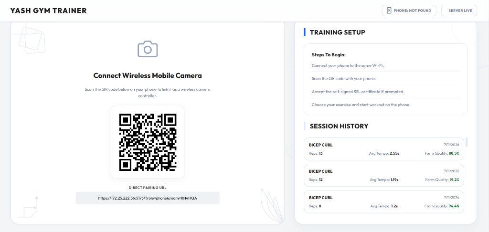
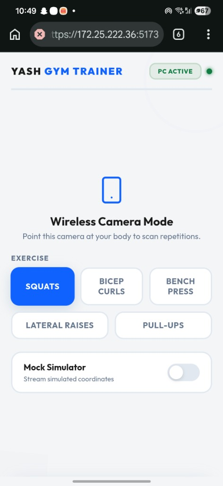
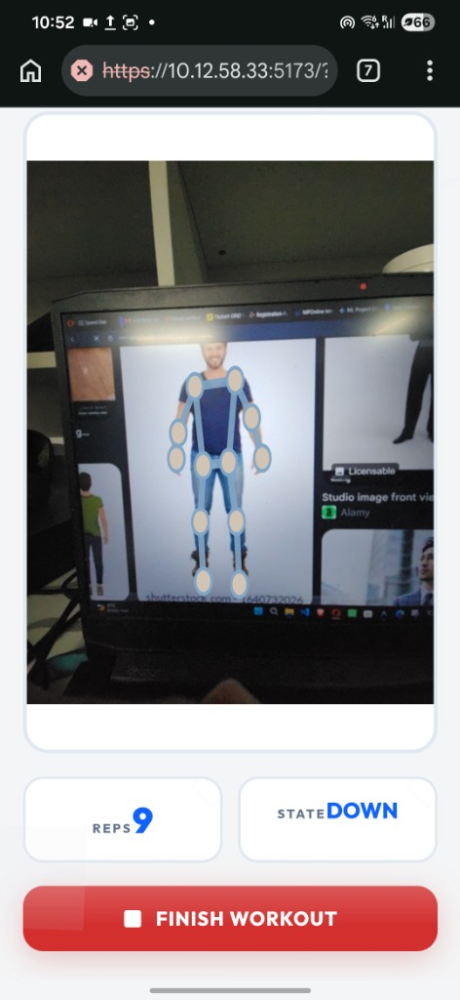

# Yash Gym Trainer: Real-Time Workout Form Corrector & Analytics Platform

**Yash Gym Trainer** is a premium, dual-device web application that transforms your smartphone into a wireless camera and utilizes real-time deep learning (YOLOv8-Pose) to analyze your workout form, count repetitions, provide live corrective coaching, and generate detailed session report cards.

---

## 📸 Working Showcase

### 1. Desktop Setup & Pairing
Start the application on your PC. It will generate a dynamic pairing QR code and construct a local LAN URL for direct linking. Your session logs and historical logs are saved on SQLite.



### 2. Mobile Controller Setup
Scan the QR code on your phone to open the mobile controller. Choose your exercise (Squats, Bicep Curls, Bench Press, Lateral Raises, or Pull-Ups) and toggle the camera/simulators.



### 3. Real-Time Tracking & Skeleton Overlay
Position your phone camera to capture your body. The app runs real-time pose estimation, overlays your skeleton, tracks joint angles, and streams performance statistics back to your PC dashboard.



---

## 🚀 Key Features

- **Dual-Device Synchronization:** Zero-configuration Socket.IO pairing. Use your mobile device as the camera/sensor while keeping your PC dashboard as the main metrics screen.
- **YOLOv8-Pose AI Tracking:** Powered by `ultralytics` YOLOv8-pose model for robust keypoint tracking under variable lighting and distances, with an automatic fallback to **MediaPipe Tasks PoseLandmarker**.
- **5 Major Exercises Supported:**
  - **Squats:** Knee depth hinge vs standing angles, knee caving (valgus collapse), chest forward lean.
  - **Bicep Curls:** Dual-arm elbow flexion/extension ranges, horizontal elbow drift.
  - **Bench Press:** Torso stabilization, chest depth touch, wrist-over-elbow vertical alignment.
  - **Lateral Raises:** Shoulder abduction angles (Hip $\rightarrow$ Shoulder $\rightarrow$ Wrist), shoulder shrugging, elbow bend.
  - **Pull-Ups:** Chin height over hand levels, torso swing/kipping, dead hang extension.
- **Form Analysis & Live Coach:** Dynamic textual feedback alerts in real-time.
- **Post-Workout Analytics:** Analyst sub-agent compiles a detailed Markdown report card evaluating pacing, rhythm consistency, form score, and joint trajectory charts.
- **Apple SwiftUI-Style Aesthetics:** Clean, light geometric theme with spring bounce hover/press physics and custom transitions.

---

## 🛠️ Tech Stack

- **Frontend:** React.js, Vite, HTML5 Canvas/SVG, CSS Grid/Flexbox, Socket.IO Client.
- **Backend:** FastAPI, Python Socket.IO, OpenCV, PyTorch, Ultralytics YOLOv8, MediaPipe.
- **Database:** SQLite (SQLAlchemy) for persistent logs.

---

## 📦 Getting Started

### Prerequisites
- Python 3.10+
- Node.js 18+

### Setup & Run
1. Clone the repository:
   ```bash
   git clone https://github.com/yashsushil16/Real-Time-Workout-Form-Corrector-Analytics-Platform.git
   cd Real-Time-Workout-Form-Corrector-Analytics-Platform
   ```
2. Double-click the **`start.bat`** file in the root directory. This script will automatically:
   - Run the FastAPI backend server on `port 8000`.
   - Start the Vite React development server on `port 5173`.
3. Open `https://localhost:5173` on your PC.
4. Scan the QR code on your mobile device (connected to the same Wi-Fi network) and accept the local self-signed SSL certificates for both ports `5173` and `8000` to start training!
